# Implementation Phases

A phased roadmap for building DomChat — from zero to production SaaS.

This document defines **what to build in each phase**, **exit criteria**, and **what to defer**. Follow phases in order; do not skip Phase 2–4.

**Related docs:**
- [multiplayer-agent-solution.md](./multiplayer-agent-solution.md) — vision, prerequisites, concepts
- [use-cases.md](./use-cases.md) — eight practical use cases
- [mvp-engineering-incident.md](./mvp-engineering-incident.md) — detailed spec for Phase 4

---

## Overview

```mermaid
flowchart LR
    P0[Phase0_Setup] --> P1[Phase1_Foundation]
    P1 --> P2[Phase2_Multiplayer]
    P2 --> P3[Phase3_AgentV1]
    P3 --> P4[Phase4_CollaborationMVP]
    P4 --> P5[Phase5_EngineeringDepth]
    P5 --> P6[Phase6_SecondWedge]
    P6 --> P7[Phase7_Platform]
    P7 --> P8[Phase8_ProductionSaaS]
```



| Phase | Name | Duration (solo, ~15 hrs/week) | Outcome |
|---|---|---|---|
| 0 | Setup & learning | 3–5 days | Dev stack + core concepts understood |
| 1 | Foundation | 1 week | Auth, workspace, incident CRUD |
| 2 | Multiplayer shell | 1 week | Live room, presence, timeline |
| 3 | Agent v1 | 1 week | Background agent runs, repo read tools |
| 4 | Collaboration MVP | 2 weeks | **Ship engineering incident MVP** |
| 5 | Engineering depth | 2–3 weeks | Private repos, sandbox, PR flow |
| 6 | Second wedge | 3–4 weeks | Support or sales room template |
| 7 | Platform generalization | 4–6 weeks | Generic sessions + connectors |
| 8 | Production SaaS | 2–3 months | Billing, SSO, reliability, scale |

**First shippable product:** end of Phase 4 (~6–7 weeks from start).

---

## Phase 0 — Setup & Learning

**Duration:** 3–5 days  
**Goal:** Environment ready; core concepts understood before writing product code.

### Build

- Install tooling: Node.js, Docker, Postgres, Redis, Git
- Read [multiplayer-agent-solution.md](./multiplayer-agent-solution.md) — sections 3 and 4 (prerequisites + concepts)
- Spike: one Next.js page + one streaming LLM endpoint (no database yet)
- Optional: minimal WebSocket echo server to understand pub/sub

### Learn

- WebSockets vs REST for live updates
- LLM streaming and tool calling
- Event-sourced timeline (append-only events)
- Agent loop: plan → tool → observe → repeat

### Exit criteria

- [ ] Local Postgres and Redis run via Docker
- [ ] LLM streaming works in browser
- [ ] You can explain: session, event, run, artifact, redirect, handoff

### Do not build yet

- Multi-tenant SaaS
- Docker sandboxes
- GitHub OAuth / CRM integrations
- Billing

---

## Phase 1 — Foundation

**Duration:** 1 week  
**Goal:** Auth, workspace, and incident CRUD — no agent, no realtime.

### Build

| Item | Details |
|---|---|
| App scaffold | Next.js 14+ (App Router), TypeScript, Tailwind |
| Auth | Sign up / sign in (Auth.js, Clerk, or Supabase Auth) |
| Workspace | Create workspace, add members |
| Database | Postgres + Prisma; tables: `users`, `workspaces`, `workspace_members`, `incidents` |
| API | CRUD for incidents |
| UI | Incident list page, create incident form |

### Incident fields (v1)

- Title, severity (`sev1` | `sev2` | `sev3`)
- Repo URL
- Status (initial: `open`)
- Owner, created_by, timestamps

### Exit criteria

- [ ] User can sign in and create a workspace
- [ ] User can create and list incidents
- [ ] Incident data persists across refresh
- [ ] Basic role on workspace: admin | member

### Demo

> “Create an incident record and view it in the list.”

### Do not build yet

- WebSockets
- Agent runs
- Artifacts
- Share-link join flow (can stub URL only)

---

## Phase 2 — Multiplayer Shell

**Duration:** 1 week  
**Goal:** Shared room with live presence, human chat, and persisted timeline.

### Build

| Item | Details |
|---|---|
| Incident room | `/incidents/:id` — main collaboration UI |
| WebSocket gateway | Join/leave channel `incident:{id}` |
| Redis pub/sub | Broadcast events to all connected clients |
| Presence | Who is in the room; join/leave events |
| Human messages | Send message → broadcast → persist |
| Event log | `incident_events` table; append-only |
| Timeline UI | Render events; replay on page refresh |
| Share link | URL to join incident; auto-add participant |
| Roles | `viewer` \| `contributor` \| `owner` on `incident_participants` |

### Exit criteria

- [ ] Two browser sessions join same incident
- [ ] Messages appear for all participants within ~2 seconds
- [ ] Page refresh restores full timeline
- [ ] Viewer cannot send messages (403 / disabled UI)
- [ ] Presence list updates on join/leave

### Demo

> “Two engineers open the same incident room and chat in real time.”

This is the first **multiplayer moment** — even without AI.

### Do not build yet

- Agent runs
- Tool calls
- Approvals
- GitHub integration

---

## Phase 3 — Agent v1

**Duration:** 1 week  
**Goal:** Agent runs in background; all participants watch it work live.

### Build

| Item | Details |
|---|---|
| Job queue | BullMQ + Redis worker for agent runs |
| `agent_runs` table | Status: queued, running, stopped, completed, failed |
| Start/stop API | `POST /incidents/:id/runs`, stop endpoint |
| Streaming | Agent tokens streamed to timeline via WebSocket |
| Context paste | Attach logs, stack traces to session (`incident_context`) |
| Read-only tools | `read_file`, `search_repo` via GitHub API (public repos) |
| Tool events | Emit `tool.call` and `tool.result` on timeline |
| Run limits | Max steps, max duration (e.g. 20 steps, 10 min) |

### Agent loop (minimal)

```text
1. Load incident + context + repo URL
2. LLM plans → tool call → observe → repeat
3. Stream text and tool events to all clients
4. Mark run completed or failed
```

### Exit criteria

- [ ] User starts run from incident room
- [ ] All participants see streaming agent output
- [ ] Agent reads/searches public GitHub repo
- [ ] Tool calls visible on timeline
- [ ] Run completes with clear status

### Demo

> “On-call pastes a Sentry stack trace; agent investigates the repo while teammate watches live.”

### Do not build yet

- Redirect (Phase 4)
- Diff artifacts
- Approvals
- Private repo access

---

## Phase 4 — Collaboration MVP (Ship Here)

**Duration:** 2 weeks  
**Goal:** Complete **Engineering Incident Room MVP** — first shippable product.

**Full spec:** [mvp-engineering-incident.md](./mvp-engineering-incident.md)

### Build

| Item | Details |
|---|---|
| Stop / redirect | Cancel or steer active run; log `redirect` events |
| Artifacts | `root_cause`, `diff`, `postmortem` types |
| Diff viewer | Unified diff panel in incident room |
| Approval flow | Approve/reject diff → `ready_for_pr` status |
| Handoff | Transfer ownership; update participant roles |
| Status machine | `open → investigating → fix_proposed → ready_for_pr → resolved` |
| Agent tools | `summarize_root_cause`, `propose_diff`, `draft_postmortem` |
| Polish | Error states, empty states, share link copy |

### Exit criteria

- [ ] Teammate joins mid-run and redirects agent
- [ ] Diff artifact created and approved in-session
- [ ] Ownership handed off; new owner can resolve
- [ ] Full timeline replayable after handoff
- [ ] 5-minute demo script runs end-to-end

### Demo script

1. Create session `prod-payment-500-error`, paste stack trace
2. Start investigation — show live tool calls
3. Second user joins as backend lead, redirects agent
4. Diff artifact appears; reviewer approves
5. Hand off to reviewer; mark resolved
6. Show timeline replay

### Stop and validate

Get feedback from 3–5 engineers before Phase 5. Do not add features until core loop is validated.

### Phase 4 MVP checklist

- [ ] Auth + workspace
- [ ] Create/join incident via URL
- [ ] Live presence
- [ ] Shared timeline (persisted)
- [ ] Agent run with streaming
- [ ] Stop + redirect
- [ ] Diff artifact + approval
- [ ] Handoff ownership
- [ ] Mark resolved + artifacts saved

---

## Phase 5 — Engineering Depth

**Duration:** 2–3 weeks  
**Goal:** Make the engineering wedge useful in real production workflows.

### Build

| Item | Details |
|---|---|
| GitHub App | OAuth for private repos per workspace |
| Sentry integration | Webhook or API — auto-attach errors to incident |
| Docker sandbox | Isolated environment for agent code exploration |
| PR creation | Approved diff → branch + PR via GitHub API |
| Run resume | Persist run state; survive worker crash |
| Notifications | Slack or email: handoff, approval needed, resolved |
| Long runs | Runs lasting 30+ minutes without state loss |

### Exit criteria

- [ ] Private repo connected to workspace
- [ ] Approved diff opens a GitHub PR automatically
- [ ] Worker restart does not lose in-progress run
- [ ] Sentry error can seed incident context

### Do not build yet

- Sales CRM
- Support ticket connectors
- Multiple room templates

---

## Phase 6 — Second Wedge

**Duration:** 3–4 weeks  
**Goal:** Prove the platform works outside engineering.

### Pick one

| Option | Session type | Connector | Key artifact |
|---|---|---|---|
| **A — Support** | Ticket escalation room | Zendesk / Intercom / Freshdesk | Customer reply draft + resolution summary |
| **B — Sales** | Deal room | CRM (HubSpot / Salesforce) or manual paste | Deal summary + approved outbound email |

### Build (either option)

- New session template (UI labels, default prompt, artifact types)
- Domain connector (read ticket/deal context)
- Domain-specific approval (refund, outbound email)
- Reuse: sessions, timeline, redirect, handoff, approvals from Phases 1–4

### Exit criteria

- [ ] New template creatable from UI
- [ ] Connector pulls external context into session
- [ ] Domain artifact generated and approvable
- [ ] Shift/deal handoff works with full timeline

### Demo

**Support:** Morning agent investigates ticket; evening agent continues same session.  
**Sales:** AE + manager collaborate on deal; manager approves email before send.

---

## Phase 7 — Platform Generalization

**Duration:** 4–6 weeks  
**Goal:** One platform, many room types — not separate apps per domain.

### Build

| Item | Details |
|---|---|
| Generic sessions | `incidents` → `sessions` with `template` field |
| Connector framework | Pluggable adapters: GitHub, Sentry, CRM, tickets |
| Artifact registry | Template defines allowed artifact types |
| Template picker | Incident / Deal / Ticket / Feature / Campaign |
| Admin settings | Integrations, approval policies, retention |
| Audit export | Export session timeline for compliance |

### Map use cases to templates

All eight use cases from [use-cases.md](./use-cases.md) should map to:

- One session template
- One or more connectors
- Defined artifact types
- Shared multiplayer primitives

### Exit criteria

- [ ] New room type addable without rewriting core
- [ ] Admin configures required approvals per template
- [ ] At least 3 templates live (incident + 2 others)

---

## Phase 8 — Production SaaS

**Duration:** 2–3 months  
**Goal:** Real customers, reliability, monetization.

### Build

| Area | Items |
|---|---|
| Billing | Stripe: plans, usage limits, LLM cost caps |
| Enterprise auth | SSO / SAML |
| Security | Tenant isolation audit, secrets management, data retention policies |
| Reliability | Uptime targets, graceful degradation, run retry policies |
| Observability | Structured logs, traces, run success/failure metrics |
| Onboarding | Self-serve workspace setup, integration wizard |
| Legal | Terms, privacy, data processing |

### Exit criteria

- [ ] Paying team can sign up and connect integrations self-serve
- [ ] SLA or internal uptime target defined and monitored
- [ ] Security baseline documented
- [ ] Cost controls prevent runaway LLM spend

---

## Phase Dependencies

```text
Phase 0 ──required──▶ Phase 1
Phase 1 ──required──▶ Phase 2
Phase 2 ──required──▶ Phase 3
Phase 3 ──required──▶ Phase 4  ◀── FIRST SHIP
Phase 4 ──recommended──▶ Phase 5
Phase 5 ──optional parallel──▶ Phase 6 (after Phase 4 validated)
Phase 6 ──required──▶ Phase 7
Phase 7 ──required──▶ Phase 8
```

**Do not parallelize Phases 2–4.** Multiplayer, agent, and collaboration controls are tightly coupled.

---

## Skills Focus by Phase

| Phase | Primary skills | If skipped |
|---|---|---|
| 0 | LLM APIs, WebSocket basics | Over-engineering too early |
| 1 | Postgres, auth, REST | Unstable foundation |
| 2 | WebSockets, pub/sub, event logs | Feels like Slack, not multiplayer AI |
| 3 | Job queues, agent orchestration, tool calling | Just a chat app |
| 4 | RBAC, state machines, UX for handoff/approval | No differentiation vs private AI chat |
| 5 | GitHub API, Docker, webhooks | Engineering wedge too shallow |
| 6 | Third-party APIs, template design | Product looks like a one-off |
| 7 | Abstractions, plugin architecture | Every feature becomes a rewrite |
| 8 | DevOps, billing, security | Cannot scale to teams |

---

## Recommended Tech Stack by Phase

| Phase | Add to stack |
|---|---|
| 0–1 | Next.js, TypeScript, Postgres, Prisma, Auth provider |
| 2 | WebSocket server, Redis |
| 3 | BullMQ, OpenRouter/OpenAI, GitHub REST API |
| 4 | — (complete MVP on existing stack) |
| 5 | Docker, GitHub App, Sentry API, Slack webhook |
| 6 | Zendesk/HubSpot API (chosen wedge) |
| 7 | Connector SDK, admin dashboard |
| 8 | Stripe, SSO provider, observability (e.g. Axiom, Sentry) |

---

## Success Metrics by Phase

| Phase | Metric | Target |
|---|---|---|
| 2 | Two users see same message | < 2s latency |
| 3 | Agent run completes with tools | > 80% success on demo repo |
| 4 | Incidents with 2+ participants | > 60% of demo sessions |
| 4 | Redirect used | > 30% of incidents |
| 4 | Diff approved in-session | > 50% of fix_proposed |
| 5 | PR created from approved diff | 100% of approved diffs |
| 6 | Second template adopted | ≥ 1 team using non-incident room |
| 8 | Paid workspace retention | Define after first 10 customers |

---

## What Not to Do (Anti-Patterns)

| Mistake | Why it hurts | Instead |
|---|---|---|
| Build Phase 8 billing in Phase 1 | Distraction | Ship Phase 4 first |
| Add sales + support in Phase 4 | Scope creep | One wedge only |
| Skip Phase 2 event log | No replay, no audit | Append-only events from day one |
| Auto-merge code in MVP | Trust and safety risk | Diff + approval only |
| Fully autonomous agents | Hard to debug, hard to trust | Human-in-the-loop default |
| Private repo before public repo works | Integration complexity early | Public repo + paste logs in Phase 3–4 |

---

## Solo Builder Schedule (Summary)

| Weeks | Phase | Milestone |
|---|---|---|
| 1 | 0 + 1 | Auth + incidents in DB |
| 2 | 2 | Live multiplayer room |
| 3 | 3 | Agent investigates repo |
| 4–5 | 4 | **MVP shipped** |
| 6–8 | 5 | Private repos + PR flow |
| 9–12 | 6 | Support or sales wedge |
| 13+ | 7–8 | Platform + SaaS |

---

## Next Step

Start **Phase 0**, then **Phase 1** scaffolding:

1. Initialize Next.js monorepo
2. Add Prisma + Postgres schema for users, workspaces, incidents
3. Add auth
4. Build incident list + create form

When Phase 1 exit criteria are met, proceed to Phase 2.
